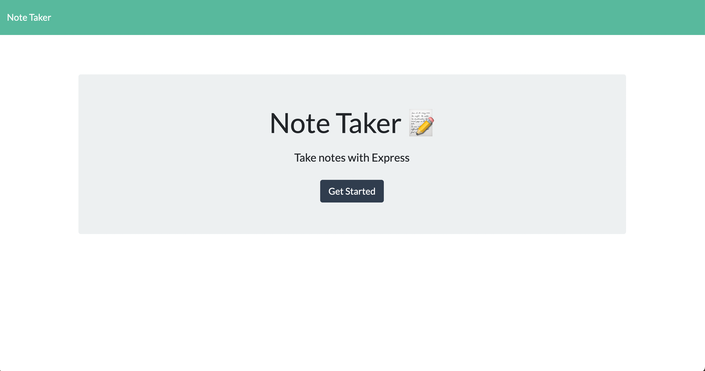
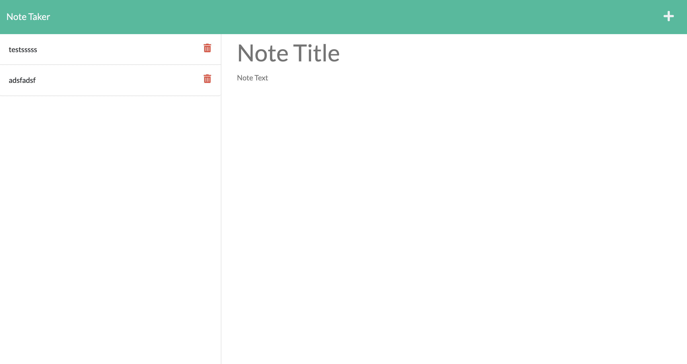

# note-taker

## Description
This application saves notes that the user will input.  When the page is closed and accessed again, the user will see that their previously input notes. 

I learned about creating a server with express, connecting it to client side js and html, as well as storing user input data.

## Table of Contents (Optional)
1. [Installation](#installation) 
2. [Usage](#usage) 
3. [License](#license) 
4. [Questions](#questions) 

## Installation
clone the repo.

## Usage

Link to the live site can be found below:
https://jasonwisniewski.github.io/note-taker/

This can be used by anyone who wants to keep track of their notes.

## License
MIT
https://choosealicense.com/licenses/mit/

MIT License

Copyright (c) 2022 undefined

Permission is hereby granted, free of charge, to any person obtaining a copy
of this software and associated documentation files (the "Software"), to deal
in the Software without restriction, including without limitation the rights
to use, copy, modify, merge, publish, distribute, sublicense, and/or sell
copies of the Software, and to permit persons to whom the Software is
furnished to do so, subject to the following conditions:

The above copyright notice and this permission notice shall be included in all
copies or substantial portions of the Software.

THE SOFTWARE IS PROVIDED "AS IS", WITHOUT WARRANTY OF ANY KIND, EXPRESS OR
IMPLIED, INCLUDING BUT NOT LIMITED TO THE WARRANTIES OF MERCHANTABILITY,
FITNESS FOR A PARTICULAR PURPOSE AND NONINFRINGEMENT. IN NO EVENT SHALL THE
AUTHORS OR COPYRIGHT HOLDERS BE LIABLE FOR ANY CLAIM, DAMAGES OR OTHER
LIABILITY, WHETHER IN AN ACTION OF CONTRACT, TORT OR OTHERWISE, ARISING FROM,
OUT OF OR IN CONNECTION WITH THE SOFTWARE OR THE USE OR OTHER DEALINGS IN THE
SOFTWARE.

## Questions
github username: JasonWisniewski

github link : https://github.com/JasonWisniewski

If you have any additional questions you can reach me at jwizinpa95@gmail.com
